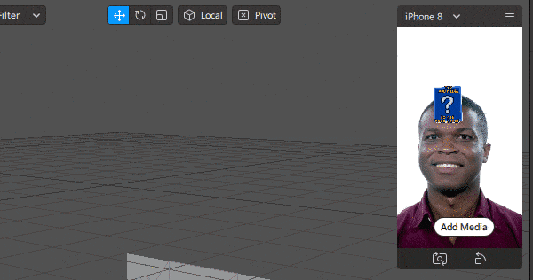
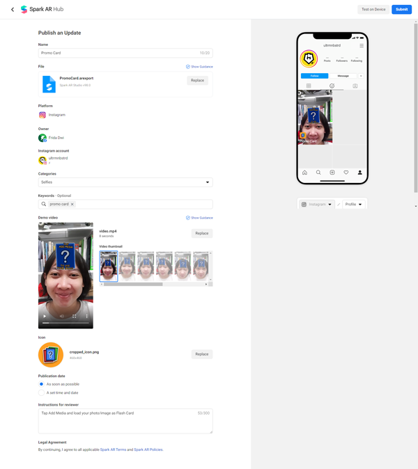

# Overview

Artikel ini akan mencoba membantu kamu menggunakan Spark AR Studio untuk pertama kalinya, beberapa hal yang akan dicakup dalam artikel ini adalah :

* Persiapan dan cara menginstall Spark AR Studio
* Membuat filter sederhana berupa Flash Card dengan fitur Gallery Texture, dimana nantinya user dapat menggunakan gambar atau fotonya sendiri pada Filter.
* Testing dan langkah-langkah untuk mempublish Filter yang telah kita buat 

Diharapkan setelah mengikuti artikel ini kamu sudah bisa membuat filter mu sendiri yang dapat berfungsi dengan baik dan berhasil merilisnya untuk digunakan oleh masyarakat umum.

# Menginstall Spark AR Studio

Spark AR Studio adalah platform augmented reality untuk Mac & Windows yang memungkinkan kita membuat efek AR untuk kamera seluler dengan mudah.

## Persyaratan
Untuk menginstall Spark AR Studio ada beberapa hal yang perlu kita persiapkan.

### Hardware
Spark AR Studio membutuhkan PC dengan spesifikasi minimum seperti berikut
* Sistem Operasi : Minimum Windows 10 (64 bit) atau MacOS 10.14+
* RAM minimum 4GB
Spesifikasi lebih detail dapat dilihat pada laman https://sparkar.facebook.com/ar-studio/learn/downloads/#system-requirements

### Akun
Untuk menggunakan Spark AR Studio dan mempublikasikan Filter yang akan kita buat, dibutuhkan beberapa akun yaitu :
* Akun Facebook, untuk login dan menggunakan Spark AR Studio serta mengorganisir project yang akan kita publish.
* Akun Instagram yang terkoneksi dengan akun Facebook tadi, untuk testing dan publishing Filter yang kita buat.

### Download Installer
Apabila seluruh persyaratan telah terpenuhi sekarang kita bisa mulai install Spark AR Studio dengan mengunduh versi terbarunya di

https://sparkar.facebook.com/ar-studio/learn/downloads/#spark-ar-studio

Saat artikel ini dibuat, versi terbaru yang digunakan adalah v98. Setelah berhasil mengunduh installer, silahkan install sesuai dengan langkah-langkah yang ditampilkan.

### Login Facebook
Hal yang akan muncul saat kita pertama kali membuka Spark AR Studio adalah popup login akun Facebook, isilah dengan data akunmu dan kemudian kamu dapat menggunakan Spark AR Studio.

Untuk Logout Spark AR Studio dari akun yang digunakan saat ini, bisa dilakukan setelah membuka projek dengan cara : klik **File** lalu pilih **Logout**.

# Membuat Project Baru

Tampilan awal dari Spark AR Studio adalah list beberapa template yang disediakan, dan terdapat beberapa tutorial yang bisa kamu ikuti.

## Membuka Blank Project

Untuk saat ini kita akan memulai dengan membuat project baru dari awal.

Klik **Create New** > **New Project**.

Akan ditampilkan popup tipe project yang bisa kamu buat. Karena saat ini kita akan belajar dari awal, maka pilihlah **Blank Project**.

## Tampilan utama Spark AR Studio
Spark AR Studio akan membuka sebuah window baru yang akan menjadi workarea kita. Jika diperhatikan, workarea kita terbagi menjadi beberapa area utama.

- A adalah panel Scene. Scene berguna untuk mengatur hirearki objek-objek yang akan kita gunakan. Secara default sudah disiapkan Ambient Light dan Directional Light. Untuk project ini akan kita abaikan saja kedua object light tersebut.
- B adalah panel Assets. Panel Assets akan kita gunakan untuk mengorganisir file yang kita gunakan pada project, seperti Image dan Material.
- C adalah panel View. Pada bagian tengah akan menjadi work area utama dimana kita bisa melihat dan mengedit secara langsung posisi dan ukuran objek-objek pada projek kita.
- D adalah panel Properties. Pada sisi kanan tersedia panel Properties yang bisa digunakan untuk mengatur setting dari object yang kita gunakan.

## Menambahkan Face Tracker
Mendeteksi wajah adalah hal utama yang kita butuhkan untuk membuat filter ini, dengan menggunakan Spark AR Studio fitur ini sangat mudah kita buat karena Spark AR Studio telah menyediakan beberapa jenis Tracker diantaranya Face Tracker.

Untuk menggunakan Face Tracker sangatlah mudah, pada panel **Scene** klik tombol **Add Object** yang berada di sisi kanan bawah lalu pilih **Face Tracker** kemudian klik **Insert**.

Objek **Face Tracker** akan automatis ditambahkan pada hierarki **Scene**.
Jika diinginkan kamu juga dapat mengganti nama objek yang sudah kita buat dengan menekan key **F2** atau dengan klik kanan lalu pilih **Rename**.

## Menambahkan Objek Plane
Setelah Face Tracker, sekarang kita membutuhkan sebuah objek yang akan menjadi tempat ditampilkannya gambar filter kita. Kita akan menambahkan sebuah objek dengan tipe Plane.

Untuk menambahkan **Plane** kita klik tombol **Add Object** pada panel **Scene**, lalu pilih **Plane** kemudian klik **Insert**.

Objek **Plane** telah ditambahkan pada panel **Scene** dan juga tampak pada panel **3D View**. Namun objek **Plane** masih diam tidak mengikuti gerakan wajah, ini akan kita perbaiki pada langkah selanjutnya.

## Mengatur Ulang Hierarki Objek
Untuk membuat objek **Plane** bisa bergerak sesuai dengan gerakan wajah, kita perlu mengatur ulang ususan hierarki objek pada **Scene**. Kita perlu memindahkan **Plane** masuk kedalam **Face Tracker** agar dapat bergerak bersama dengan gerakan wajah.

Untuk memindahkan, pada panel **Scene** drag dan drop objek **Plane** kedalam objek **Face Tracker**.

Dan hasilnya, objek **Plane** ikut bergerak sesuai gerakan wajah.

## Mengatur Posisi Objek
Jika kita perhatikan saat ini posisi objek **Plane** menutupi wajah, kita perlu mengatur posisi ini agar sesuai dengan yang kita inginkan. Ada beberapa cara yang bisa dilakukan yaitu dengan langsung menggeser objek melalui panel **3D View** atau dengan menggunakan input pada panel **Properties**.

### Menggunakan Panel 3D View
Memindah objek via **3D View** dapat dilakukan dengan menggeser menggunakan garis panah yang ada. Pertama untuk mempermudah menggeser objek, kita **Pause** kamera preview dengan menekan tombol pause disisi kiri layar.

Dan untuk menggeser tinggal klik objek pada panel **Scene** dan pada **3D View** arahkan garis panah objek ke posisi yang diinginkan.

### Menggunakan Panel Properties
Untuk memindahkan objek dengan lebih persisi kita bisa menggunakan panel **Properties**. Sebagai contoh kita klik objek pada panel **Scene** dan pada panel **Properties** kita ubah nilai Position Y menjadi 0.1 sehingga posisi objek **Plane** berpindah ke dahi.

Selain untuk memindahkan objek, cara-cara tadi juga bisa digunakan untuk mengubah ukuran dan rotasi objek. Silahkan dicoba-coba.
Selanjutnya kita akan menambahkan **Material** agar objek dapat memiliki warna atau gambar.

## Menambahkan Material

Jika kita perhatikan objek **Plane** saat ini ditampilkan dalam warna kotak catur hitam-putih, itu artinya objek **Plane** belum memiliki data yang akan ditampilkan pada layar. Untuk memberikan tampilan pada objek **Plane** kita membutuhkan sebuah aset yang disebut **Material**.

**Material** adalah aset yang akan mengontrol bagaimana sebuah objek akan ditampilkan pada layar. **Material** bisa menampilkan warna, gambar, animasi maupun video.

Untuk menambahkan **Material** klik tombol **Add Asset** pada panel **Assets** lalu pilih Material.

## Memasang Material Pada Objek

Setelah memiliki aset **Material** langkah selanjutnya akan kita pasangkan **Material** tersebut ke objek **Plane**.

Seleksi objek **Plane** pada panel **Scene**, lalu pada panel **Properties** perhatikan bagian **Materials**. Klik tombol **+** untuk memilih **Material** yang sudah kita siapkan.

Setelah dipasangkan **Material**, objek **Plane** berubah warna menjadi putih, mengikuti pengaturan **Material** yang diberikan.

Pada bagian selanjutnya kita akan menambahkan fungsi mengambil gambar dari file image milik user dan memasangnya kedalam **Material** yang sudah dibuat, sehingga nanti user bisa membuat gambar flash cardnya sendiri.

## Menambahkan fitur Gallery Texture

Gallery Texture adalah fitur dari Spark AR Studio yang memungkinkan kita untuk menggunakan file dari Gallery user sebagai material. Untuk saat ini fitur ini hanya bisa digunakan untuk platform Instagram.

Untuk menambahkan **Gallery Texture** pada panel **Assets** klik **Add Asset** dan pilih **Gallery Texture**.

Apabila muncul sebuah **Warning Popup**, artinya kita perlu mengnonaktifkan Facebook pada Platform yang kita tuju. Klik tombol **Review Platform** lalu hilangkan tanda centang pada opsi Facebook, kemudian klik **Done** untuk menyelesaikan.

Selanjutnya kita bisa mengulangi kembali proses menambahkan **Gallery Texture**.

Setelah **Gallery Texture** ditambahkan, pada kamera preview akan muncul tombol **Add Media** yang nantinya bisa digunakan oleh user untuk memilih gambar yang dia punya.

## Memasang Texture Ke Material

Saat ini yang terlihat pada objek **Plane** adalah warna putih dari **Material** yang kita punya. Untuk langkah selanjutnya adalah kita akan mencoba memasang texture dari **Gallery Texture** ke **Material** tersebut agar gambar yang nantinya dipilih oleh user dapat ditampilkan pada objek **Plane**.

Klik **Material** yang akan diubah pada panel **Assets**. Pada panel **Properties** perhatikan bagian **Shader Properties**, pada **Texture** klik drop down button dan pilih **galleryTexture0** yang merupakan nama asset **Gallery Texture** kita.

Jika kita perhatikan, objek **Plane** yang semula berwarna putih berubah menjadi berwarna kotak catur kembali. Hal ini dikarenakan **Gallery Texture** belum memiliki data yang akan ditampilkan.

Pada langkah selanjutnya kita akan memasang sebuah gambar default yang akan ditampilkan sebelum user memilih gambarnya sendiri.

## Memasang Holding Texture

Klik **Gallery Texture** pada panel **Assets**, pada panel **Properties** berikan centang pada **Holding Texture** dan klik **Choose File**.

Pilihlah file gambar yang akan kamu gunakan, sebagai contoh kami menggunakan file yang tersedia pada github kami https://github.com/fridadwi/supreme-pancake/

Seperti nampak pada preview, objek **Plane** saat ini sudah memiliki texture default berupa image yang kita pilih tadi.

## Mencoba Fitur Add Media

Kita bisa coba klik tombol **Add Media** untuk mencoba mengubah Default image dengan file yang kita punya.

tombol inilah yang nantinya memungkinkan user menggunakan file mereka sendiri pada Filter yang kita buat.

Filter yang kita buat sudah hampir jadi, langkah selanjutnya adalah mencobanya pada device secara langsung untuk memastikan tidak ada kendala dalam penggunaannya. Hal ini akan kita lakukan pada bagian selanjutnya.

# Testing Filter Dan Menerbitkan Filter

Testing sebelum menerbitkan Filter adalah salah satu langkah paling penting untuk dilakukan untuk memastikan Filter yang kita buat berjalan dengan baik dan sesuai dengan apa yang kita rencanakan.

## Testing Filter Pada Device

Ada dua cara untuk melakukan testing pada device :
- Dengan menginstall Spark AR Player pada device
- Dengan menggunakan akun Instagram pada device

### Testing menggunakan Spark AR Player

Aplikasi Spark AR Player tersedia untuk Android dan IOS, bisa kamu download terlebih dahulu melalui link yang tersedia di https://sparkar.facebook.com/ar-studio/learn/downloads/#spark-ar-player-app.

Setelah terinstall, hubungkan device menggunakan USB.

Pada Spark AR Studio pada bagian kiri bawah terdapat beberapa button, klik pada button **Test On Device**.

Tunggu hingga muncul nama device, jika sudah muncul klik tombol **Send**. Filter automatis dijalankan pada device.

### Testing menggunakan akun Instagram
Pada Spark AR Studio pada bagian kiri bawah terdapat beberapa button, klik pada button **Test On Device**. Pada bagian **Send to App** klik **Send** pada Instagram Camera.

Apabila telah terkirim periksa Instagram pada devicemu, akan muncul notifikasi yang bisa kamu tap untuk mencoba Filter yang sudah kamu buat.

Sebenarnya kita juga bisa testing menggunakan akun Facebook (Facebook Camera), tetapi karena kita menggunakan fitur **Gallery Texture** yang hanya bisa diaplikasikan pada Instagram maka opsi Facebook Camera tidak ditampilkan.

## Publishing Filter

Sebelum memulai proses publishing, kita perlu mempersiapkan Icon dan Video demo. 
* Beberapa syarat icon yang diperlukan adalah :
   * File dalam format PNG atau JPG.
   * Tanpa layer.
   * Tidak menggunakan *rounded corner*.
   * *Color space* yang digunakan sRGB.
   * Minimal berukuran 200 x 200 pixel.
   * Tanpa menggunakan transparansi.
   * Tidak menggunakan warna gradasi Instagram.
   
   Untuk membuat icon yang sesuai dengan persyaratan silahkan cek penjelasannya di https://sparkar.facebook.com/ar-studio/learn/publishing/icons-and-names-for-spark-ar-effects. Disana juga tersedia template icon yang bisa kamu pakai agar sesuai dengan syarat yang berlaku.
    
* Beberapa syarat video demo yang diperlukan adalah:
   * Direkam dan disimpan langsung dari kamera Instagram.
   * Tidak diedit (jangan gunakan video Boomerang, jangan beri teks tambahan).
   * Rekam dalam bentuk vertikal.
   * Durasi maksimal 15 detik.
   * Besar file maksimal 34MB.
   * Upload dalam bentuk file MP4 atau MOV.
   
   Untuk membuat video demo yang sesuai dengan persyaratan silahkan cek penjelasannya di https://sparkar.facebook.com/ar-studio/learn/publishing/demo-videos-for-instagram-effects.

### Upload dan Export

Setelah menyiapkan icon dan video demo, langkah selanjutnya adalah upload project ke Spark AR Hub untuk bisa dipublish.

Pada Spark AR Studio pada bagian kiri bawah terdapat beberapa button, klik pada button **Upload and Export**. Kemudian klik **Upload** pada popup window yang muncul. Tunggu proses uploading hingga selesai.

Setelah proses upload selesai kita akan diarahkan ke laman Spark AR Hub.

Inputlah informasi dan file-file yang dibutuhkan. Beberapa hal yang perlu diperhatikan antara lain :
* Pada **Platform** hanya aktifkan **Instagram**, karena fitur **Gallery Texture** tidak tersedia di Facebook.
* Pada **Categories** pilihlah kategori yang relevan dengan Filter yang kita buat, untuk projek ini bisa dipilih **Appearence and Selfies**.
* Pada **Publication date** bisa dipilih apakah akan segera dirilis ketika mendapat persetujuan atau ingin dijadwalkan di waktu yang lain.

Setelah seluruh form terisi, untuk melanjutkan klik tombol **Submit** yang berada di sisi kanan atas laman Spark AR Hub. Apabila belum berhasil menyelesaikan pengisian form bisa klik tombol **Save** dan dilanjutkan pada kesempatan lain dengan mengakses laman https://www.facebook.com/sparkarhub/effects/.

Setelah selesai melakukan submisi, kita tinggal menunggu Filter yang kita buat mendapat approval.

## Approval

Sebelum Filter bisa digunakan oleh masyarakat luas, Filter akan melalui proses **Review** dengan jangka waktu antara 1 hingga beberapa hari.

Apabila Filter kita mendapatkan penolakan akan muncul notifikasi di Facebook dan Spark AR Hub, silahkan diperiksa alasan penolakannya dan lakukan perbaikan yang dibutuhkan. Setelah seluruh perbaikan dilakukan kita bisa melakukan submisi kembali.

Apabila Filter kita mendapat persetujuan juga akan muncul notifikasi di Facebook dan Spark AR Hub.

Untuk menggunakan Filter yang sudah mendapat persetujuan, kita bisa dapatkan link **Filter** pada **Spark AR Hub**.

Atau bisa diakses melalui **Tab Filter** pada akun **Instagram** kita, tab yang ditandai dengan icon wajah.

Dengan mendapat approval artinya Filter yang kita buat sudah bisa digunakan oleh publik untuk membuat **Instagram Story**, selamat!

# Kesimpulan
